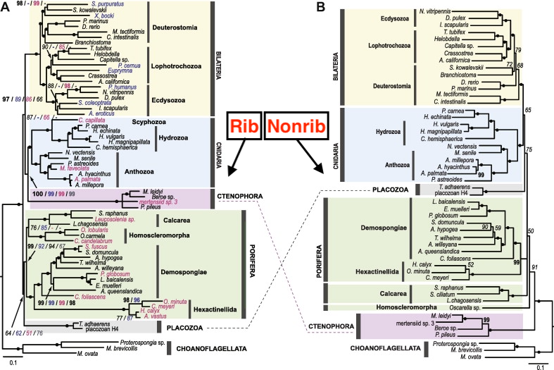
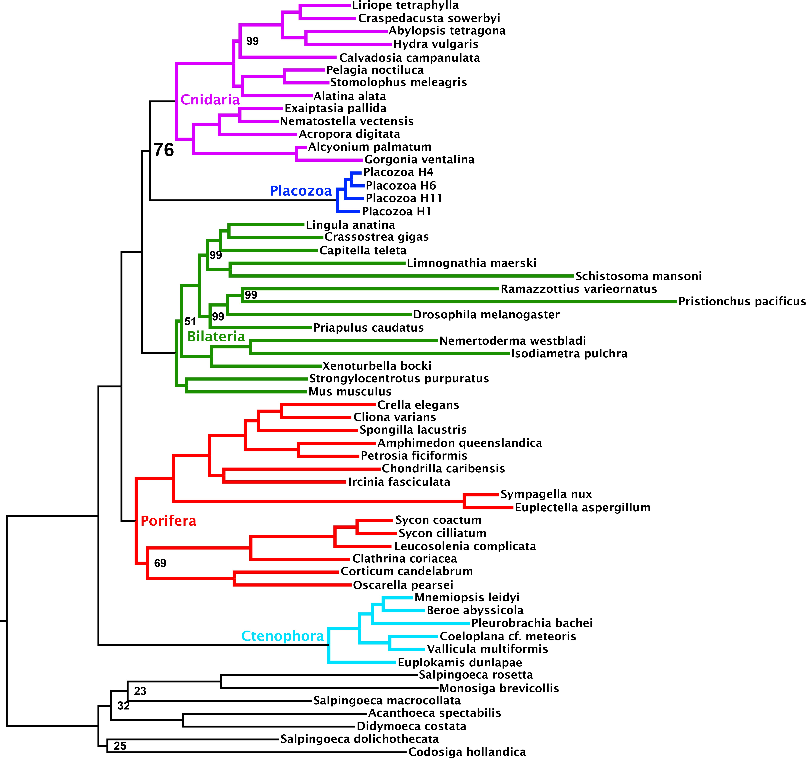
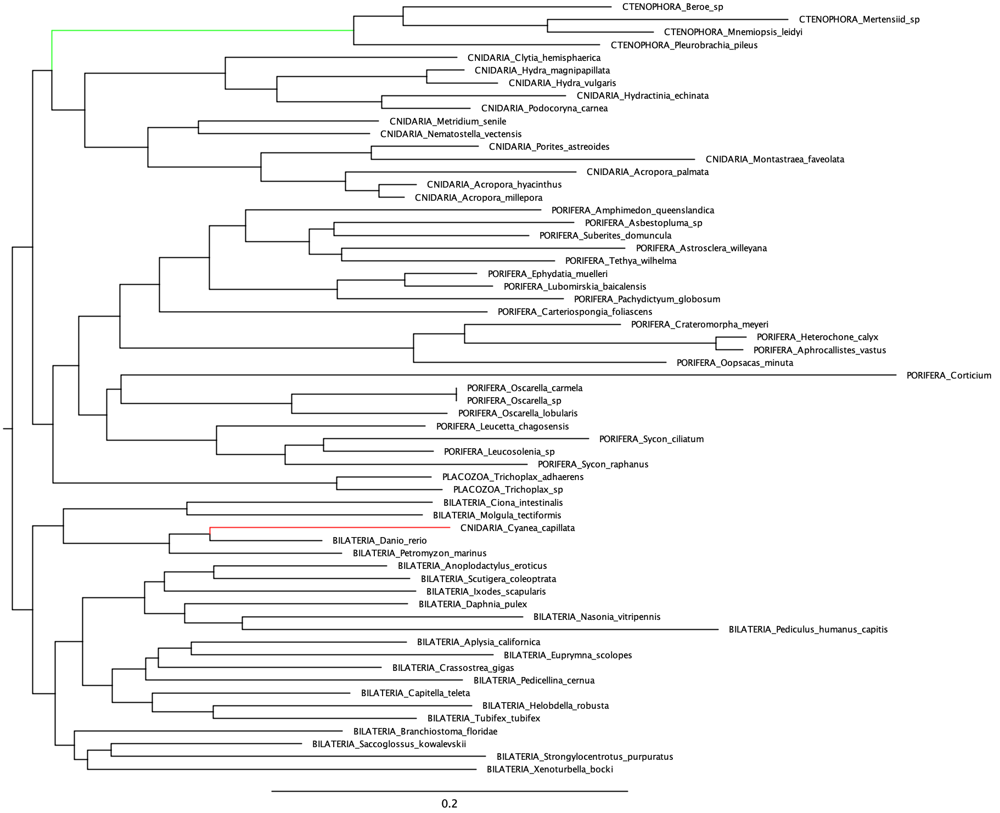
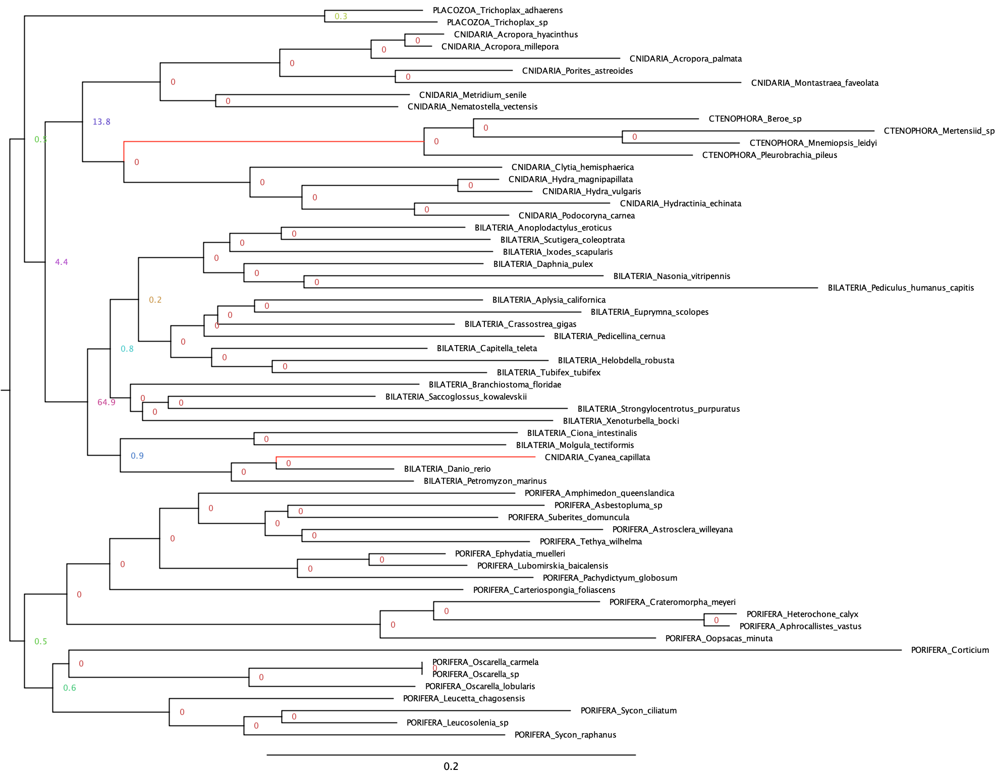
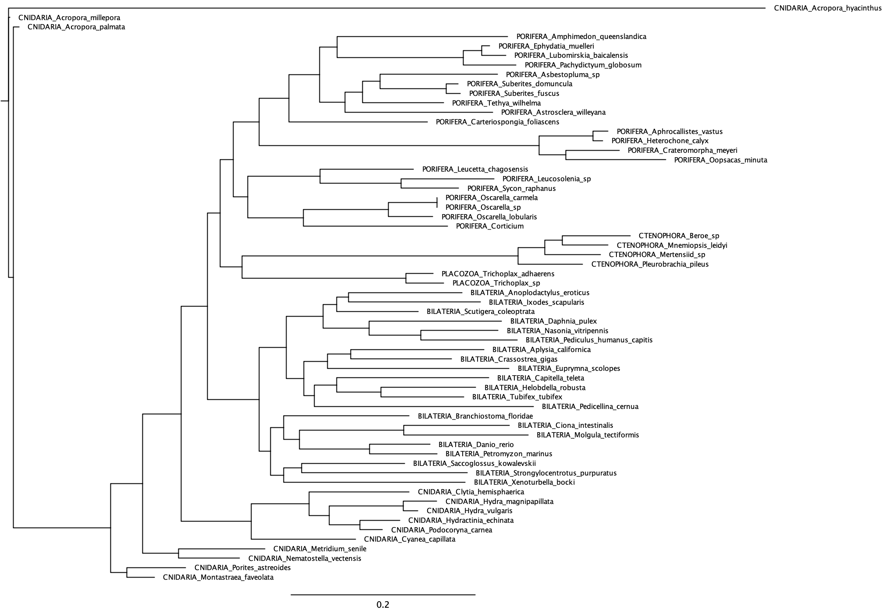
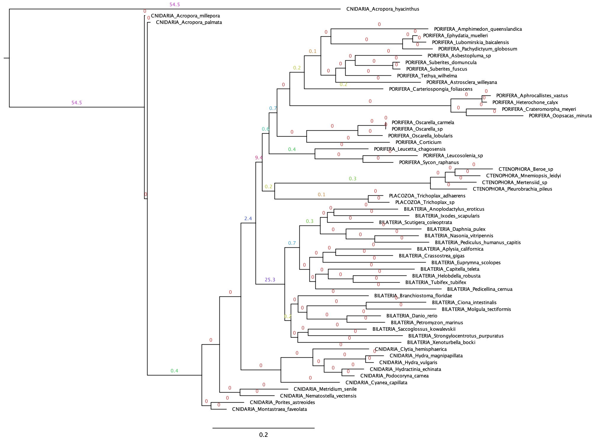
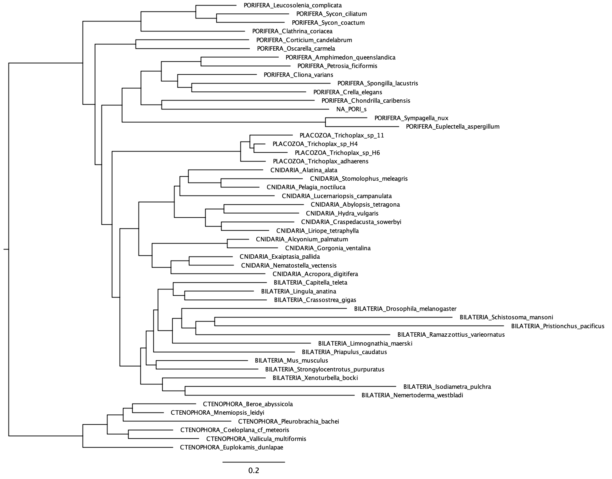

# End of Winter Update

After both the nonribosomal and ribosomal parts of the Nosenko2013 dataset gave odd results, I went back and reread the rootstrap paper. I think so far, I haven't been paying enough attention to the specific methodology of the paper. For example, using large alignments (>= 100,000 sites), removing loci that fail the MaxSym test, and investigating ΔSLS and ΔGLS scores were all important parts of the method I have so far ignored, but should factor in going forward.

In particular, I suspect that the odd results for the Nosenko2013 datasets are mainly due to the number of sites/parsimony-informative sites being too low for all the nonreversible model's parameters to be estimated accurately. So, I have started analysing the Laumer2018 dataset to see whether the greater number of sites improves performance. I shall talk a bit more about the datasets further down, but for general facts and figures of the datasets take a look at my initial project_outline.

## Results so far 

### Reference Trees

When looking at the trees below, compare them to these:

Nosenko2013:



Laumer 2018:



### Nosenko2013 Nonribosomal Dataset

I first ran the reversible model:

```
iqtree2 --seed 2222 -s ../Nosenko2013.nonrib.relabelled.outgroup_rem.fasta -p ../Nosenko2013_nonribosomal_partitions_formatted.nex -T 35 --prefix REV_nonrib
```

This gave the following REV_nonrib.treefile (rooted myself to be the same as the nonreversible model)



The lion's mane jellyfish (CNIDARIA_Cyanea_capillata; in red) is incorrectly in Bilateria, but it was also in this wrong position when I included it in my test dataset. It has very little actual data in the MSA - most are gaps, giving the model little information to go off of to determine its position. Ctenophora is green to contrast with the next tree, inferred using a nonreversible model:

```
iqtree2 --seed 2222 -s ../Nosenko2013.nonrib.relabelled.outgroup_rem.fasta -p REV.best_scheme.nex -t REV.treefile --model-joint NONREV -B 1000 -T 35 --prefix NONREV_nonrib
```

Giving the NONREV_nonrib.rootstrap.nex tree (rootstrap support shown at nodes)



So the root was inferred to be on the Bilateria branch. This also might be why Ctenophora (green) is in the middle of Cnidaria (the Ctenophora alignments in general have more gaps). This didn't happen when using the test dataset. Finally, I also did

```
iqtree2 -s ../Nosenko2013.nonrib.relabelled.outgroup_rem.fasta -p REV.best_scheme.nex --model-joint NONREV --root-test -zb 1000 -au -te NONREV_B.treefile -T 35 --prefix TOP_nonrib
```

10 roots were in the confidence set, neither of which being the Porifera (pAU 0.04919869476) or Ctenophora (pAU 0.0007777691665) branch. However, the Ctenophora branch was already placed in the wrong position (in the middle of Cnidaria), which might be a reason it's p-value is so low. 

### Nosenko2013 Ribosomal Dataset 

The reversible model

```
iqtree2 --seed 2222 -s ../Nosenko2013.rib.relabelled.outgroup_rem.fasta -p ../Nosenko2013_ribosomal_partitions_formatted.nex -T 75 --prefix REV_nonrib
```

Gave this tree (which I did **not** root myself, this is the root it defaulted to)



And the nonreversible model

```
iqtree2 --seed 2222 -s ../Nosenko2013.nonrib.relabelled.outgroup_rem.fasta -p REV.best_scheme.nex -t REV.treefile --model-joint NONREV -B 1000 -T 35 --prefix _nonrib
```

Gave this tree (with rootstraps)



So you can see, the default root of the reversible model is the same as the ML root inferred by the nonreversible model. Most likely this is a coincidence, but I thought it bears pointing out. Additionally, the root doesn't appear to have a rootstrap value, even though I'm quite sure this is exactly how the tree looked when I opened it in FigTree. Together these things make me suspect something is awry.

In any case, despite being a larger dataset, the Nosenko2013 ribosomal data has given an even weirder root than the nonribosomal one - in the middle of Cnidaria.

### Laumer2018 Dataset 

I ran

`iqtree2 --seed 2222 -s ../Laumer2018.relabelled.outgroup_rem.fasta -p ../Laumer2018_partitions_formatted.nex -T 75 --prefix REV_laumer`

This morning, giving this tree (I rooted it at ctenophora myself, to make the paraphyly of sponges obvious)



Interestingly, almost all of the taxa failed the composition test (the reverse was true for the Nosenko2013 datasets), so I should follow up on that with the MaxSym test. Also, some of the branch lengths in this tree are still extremely long, like in many of the Nosenko2013 trees.

I am currently running the nonreversible model:

```
iqtree2 --seed 2222 -s ../Laumer2018.relabelled.outgroup_rem.fasta -p REV_laumer.best_scheme.nex -t REV_laumer.treefile --model-joint NONREV -B 1000 -T 75 --prefix NONREV_laumer
```

## Future Directions

### Focus on the larger datasets
Upon seeing how odd the Nosenko2013 results were, I reviewed the rootstrap paper again, quickly finding several important points that I have so far completely ignored. Firstly, in the introduction (I've removed references from the quote, and added italics)

>"few studies have explored the accuracy of nonreversible substitution models to root phylogenetic trees. Most studies that have looked at this question in the past have focused on either simulated data sets or *relatively small empirical data sets*... no study has yet investigated the potential of amino acid substitution models in inferring the root placement of phylogenetic trees."

So the main contribution of the paper was to show the effectiveness of 1) nonreversible 2) amino acid substitution models using **3) large** 4) empirical datasets to root phylogenies. The Nosenko2013 datasets, at <10,000 sites, are quite small. The datasets likely need to be large in order to for the nonreversible amino acid model to have enough information to work with. In fact, the rootstrap paper used 'genome-scale MSAs' (>= 100,000 sites), and in Figure 3 and 5 demonstrated that in general, the greater the number of parsimony-informative sites, the greater the rootstrap support for the ML root. If we look at the number of parsimony-informative sites in our datasets (I've included the BIC scores as well for interest)

| Dataset                 | Parsimony-informative Sites | BIC (reversible, nonreversible)     | Better Model (BIC) |
|-------------------------|----------------------------|------------------------------------|--------------------|
| Nosenko2013 nonribosomal | 4558                       | (471496.1938, 472652.2213)         | R                  |
| Nosenko2013 ribosomal    | 8236                       | (822158.1018, 819768.1900)         | NR                 |
| Laumer2018               | 72871                      | (8308997.6476, ___ )               |                    |
| Simion2017               | 310886                     |                                    |                    |

In Figure 5 and 7 of the rootstrap paper (Rootstrap support vs # parsimony-informative sites), it appears that 10^4 parsimony-informative sites are generally not enough for the rootstrap support to clearly favour one hypothesis, at least in the clades they analysed. So I expect that the Nosenko datasets are not large enough, which is why I have begun with Laumer2018.

Also, though we weren't initially planning to analyse the Simion2017 dataset, I wonder now whether it could be a good option? Especially if we removed loci that fail the MaxSym test, and even further randomly subsampled it to get it to a manageable size, it would provide a good comparison to the Laumer2018 dataset. Especially as the authors of Simion2017 tried particularly hard to make sure that their data is high quality.

### Use the MaxSym test

Another finding of the rootstrap paper:

"Our results suggest that this may be the case for the data sets we analyzed: we show that removing loci that violate the stationarity and homogeneity assumptions improves the accuracy and statistical support for the placement of the root."

Following this recommendation, I should also try removing loci that fail the MaxSym test using the `--symtest-remove-bad
` option. This is particularly relevant for Laumer2018 dataset, where there appears to be significant compositional heterogeneity between taxa.


### ΔGLS and ΔSLS

Again from the rootstrap paper:

> "To ascertain whether certain sites or loci had very strong effects on the placement of the root we follow the approach of Shen et al. (2017) and calculate the difference in site-wise log-likelihood scores (ΔSLS) and gene-wise log-likelihood scores (ΔGLS)"

As per Caitlin's research, I would expect that some sites strongly favour each hypothesis. To visualise this, I will create a graph 
a la Figure A.5. in the rootstrap paper (with ΔGLS or ΔSLS on the y-axis, and the x-axis representing the different loci, sorted from greatest ΔGLS to lowest).


### BIC scores

I should also always make sure that the nonreversible model is actually a better fit than the reversible model by comparing the BIC scores for each. This would probably be best presented as a table in my final report.

## Problems

- Viewing sequences in Geneious (at least on the free version) is buggy, since the MSAs are quite large. For example, I tried to view the Laumer2018 one and it immediately crashed.
